# エージェント インストールマニュアル

## 概要

このマニュアルでは、Kamome SASEエージェントをクライアントPCにインストールする手順を説明します。

## 事前準備

インストールを開始する前に、以下を確認してください：

- [ ] システム要件を満たしていること
- [ ] 管理者権限があること
- [ ] インターネット接続が可能なこと
- [ ] テナントIDを取得していること（管理者から提供されます）
- [ ] 認証情報（ユーザー名/メールアドレス、パスワード）を取得していること（管理者から提供されます）

## インストール手順

### 1. インストーラーの入手

管理者から配布されたインストーラーを使用します。

インストーラーのファイル名は `KAMOME SASE-Setup-1.0.0.exe` のような形式です。

> **注意**: インストーラーは管理者から配布されます。バージョン番号はリリースによって異なる場合があります。

### 2. セットアップウィザードの開始

1. 配布されたインストーラー（`KAMOME SASE-Setup-1.0.0.exe`）を右クリックし、「管理者として実行」を選択します

2. ユーザーアカウント制御のダイアログが表示されたら、「はい」をクリックします

3. セットアップウィザードが起動します。インストールする前に他のアプリケーションを終了してください。「次へ(N)」をクリックします

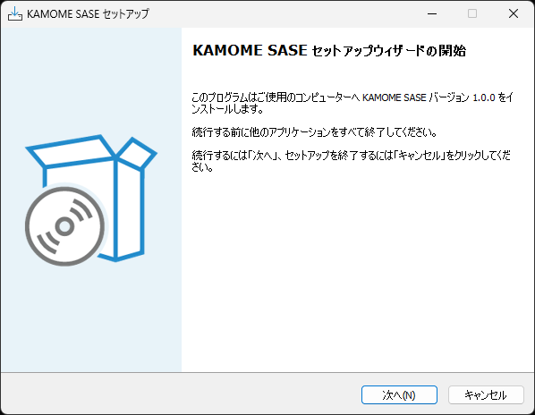

### 3. インストール先の指定

1. KAMOME SASEのインストール先フォルダを指定します
   - デフォルトは `C:\Program Files\KAMOME SASE` です
   - 変更する場合は「参照(R)」をクリックして別のフォルダを選択します

2. 必要なディスク空き容量（約378.4 MB）があることを確認します

3. 「次へ(N)」をクリックします

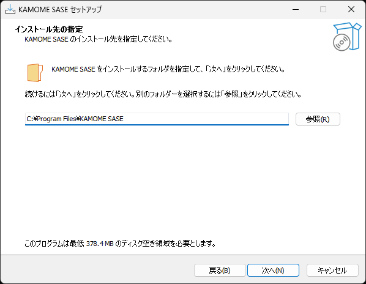

### 4. インストール方法の選択

1. インストール方法を選択します
   - **クライアント - ZTNAサーバーに接続するクライアントとしてインストールします**（エージェント用）
   - コネクター - クライアント接続を受け付けるZTNAサーバーとしてインストールします

2. エージェントとしてインストールする場合は、**「クライアント - ZTNAサーバーに接続するクライアントとしてインストールします」**を選択します（デフォルトで選択されています）

3. 「次へ(N)」をクリックします

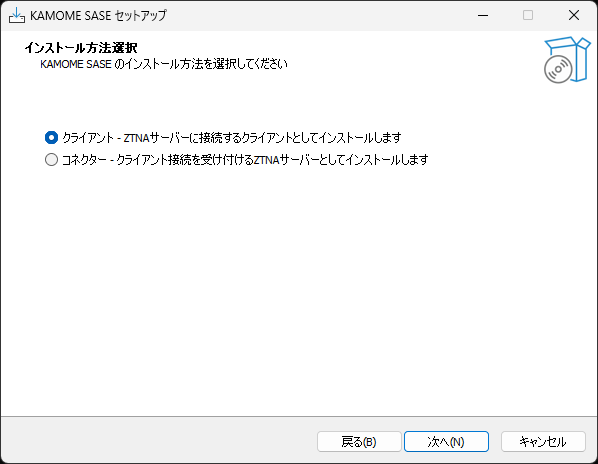

### 5. テナントIDの設定

1. 管理者から提供されたテナントIDを入力します
   - 例: `test-tenant`

2. テナントIDを入力したら、「次へ(N)」をクリックします

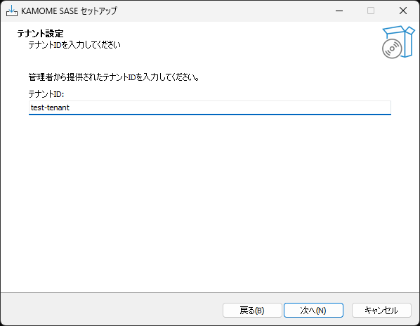

> **重要**: テナントIDは管理者から提供される固有の識別子です。正しく入力してください。

### 6. 追加タスクの選択

1. KAMOME SASEインストール時に実行する追加タスクを選択します
   - **デスクトップ上にアイコンを作成する(D)**: デスクトップにショートカットを作成します
   - **スタートメニューショートカットを作成**: スタートメニューにショートカットを作成します（デフォルトで選択）

2. 必要なオプションにチェックを入れて、「次へ(N)」をクリックします

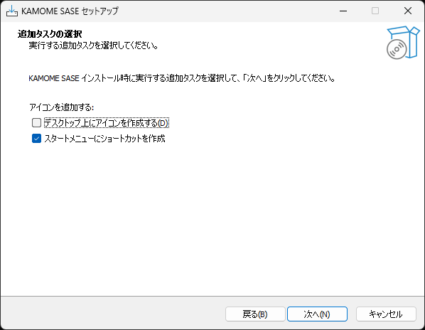

### 7. インストール準備完了

1. 設定内容を確認します
   - インストール先
   - 追加タスク一覧（アイコンを追加する、スタートメニューショートカットを作成など）

2. インストールを続けるには「インストール(I)」をクリックします
   - 設定を変更する場合は「戻る(B)」をクリックします

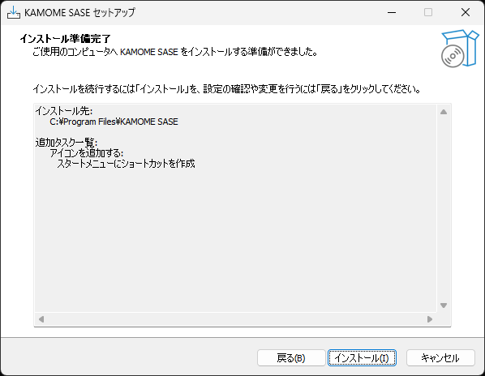

### 8. インストール状況

1. インストールが実行されます。しばらくお待ちください

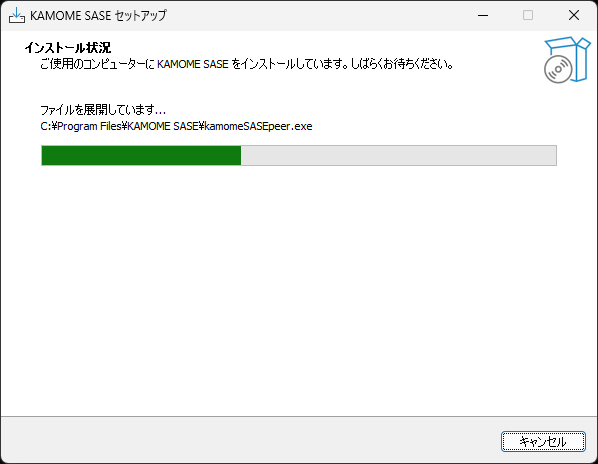

> **注意**: インストール中は他のアプリケーションを操作しないでください。

### 9. セットアップウィザードの完了

1. インストールが完了すると、完了画面が表示されます

2. 「KAMOME SASEを実行する」にチェックが入っていることを確認します
   - チェックを入れると、セットアップ終了後に自動的にKAMOME SASEが起動します

3. 「完了(F)」をクリックしてセットアップを終了します

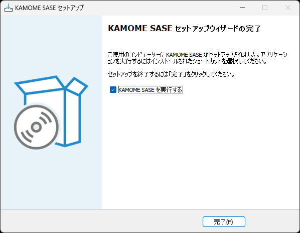

### 10. 初回起動と認証

セットアップウィザード完了後、KAMOME SASEが自動的に起動します。初回起動時は認証サーバーでの認証が必要です。

#### 10-1. Webブラウザの起動

1. セットアップ完了後、Webブラウザが自動的に起動します

2. 認証サーバーのサインイン画面が表示されます

> **注意**: ブラウザが自動的に起動しない場合は、システムトレイのKAMOME SASEアイコンを右クリックし、「認証」を選択してください。

#### 10-2. 認証情報の入力

1. 認証画面に以下の情報を入力します：
   - **Username or email**: 管理者から提供されたユーザー名またはメールアドレス
   - **Password**: 管理者から提供されたパスワード

2. 入力後、「Sign in」ボタンをクリックします

#### 10-3. 認証の完了

1. 認証が成功すると、成功画面が表示されます

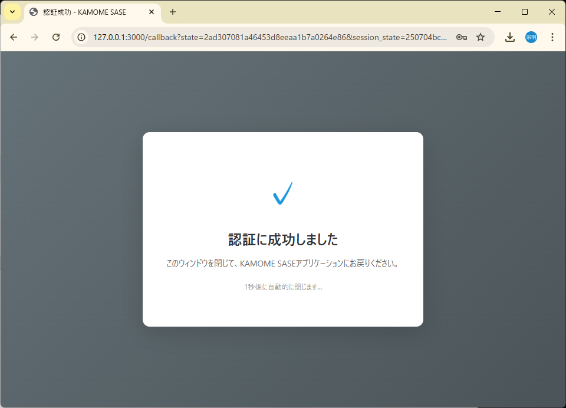

2. 「認証に成功しました」というメッセージが表示されます

3. 「このウィンドウを閉じて、KAMOME SASEアプリケーションにお戻りください」と表示され、1秒後に自動的にブラウザが閉じます

> **重要**: 認証が完了すると、KAMOME SASEアプリケーションが自動的に接続状態になります。

### 11. 動作確認

認証完了後、KAMOME SASEが正常に接続されているか確認します。

#### 11-1. システムトレイのアイコン確認

1. Windowsのタスクバー右下にあるシステムトレイを確認します

2. KAMOME SASEのアイコンが表示されています（オレンジ色と青色のアイコン）

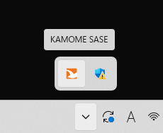

#### 11-2. トレイメニューからの確認

1. システムトレイのKAMOME SASEアイコンを右クリックします

2. メニューが表示されます

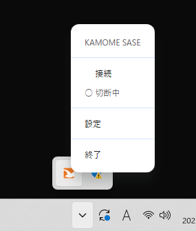 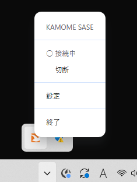

メニューには以下の項目が表示されます：
- **接続** / **切断中**: 現在の接続状態が表示されます
- **設定**: 設定ウィンドウを開きます
- **終了**: KAMOME SASEを終了します

3. 「接続」と表示され、「切断中」にラジオボタンが付いている場合は、正常に接続されています

#### 11-3. 設定ウィンドウでの確認

より詳細な情報を確認するには、設定ウィンドウを開きます。

1. トレイアイコンを右クリックし、「設定」を選択します

2. 設定ウィンドウが開きます

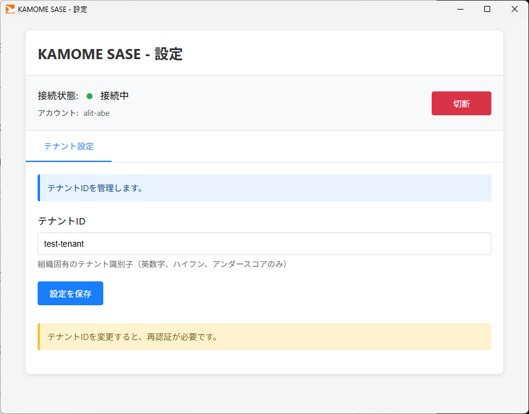

3. 設定ウィンドウで以下の情報を確認できます：
   - **接続状態**: 緑色のインジケーターと「接続中」の表示
   - **アカウント**: 認証に使用したアカウント名（例: aiit-abe）
   - **テナントID**: インストール時に設定したテナントID（例: test-tenant）

4. 接続状態が「接続中」と表示され、緑色のインジケーターが表示されていれば、正常に動作しています

> **参考**: 切断中の場合は、以下のように表示されます：

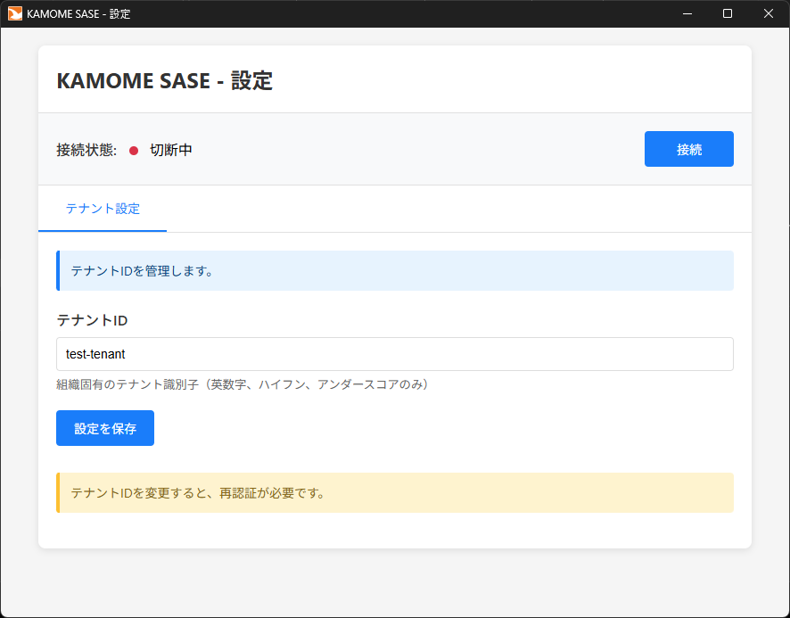

- 赤色のインジケーターと「切断中」の表示
- 「接続」ボタンが表示されます（クリックすると接続を開始します）

> **注意**: 接続・切断の操作方法や、その他の詳細な使用方法については、[操作方法](operation.md)マニュアルを参照してください。

## インストール後の設定

インストール完了後、必要に応じて以下の設定を行ってください：

- [自動起動設定](configuration.md#auto-start)
- [プロキシ設定](configuration.md#proxy)
- [ログレベル設定](configuration.md#logging)

## トラブルシューティング

インストール中に問題が発生した場合は、[トラブルシューティング](troubleshooting.md)を参照してください。

### よくある問題

- [インストーラーが起動しない](troubleshooting.md#installer-not-starting)
- [管理者権限エラー](troubleshooting.md#admin-error)
- [テナントIDのエラー](troubleshooting.md#tenant-id-error)
- [インストール後に起動しない](troubleshooting.md#not-starting)
- [認証エラー](troubleshooting.md#auth-error)

## 次のステップ

インストールが完了したら、[操作方法](operation.md)マニュアルで日常的な使用方法をご確認ください。

---

© 2026 かもめエンジニアリング株式会社. All rights reserved.
